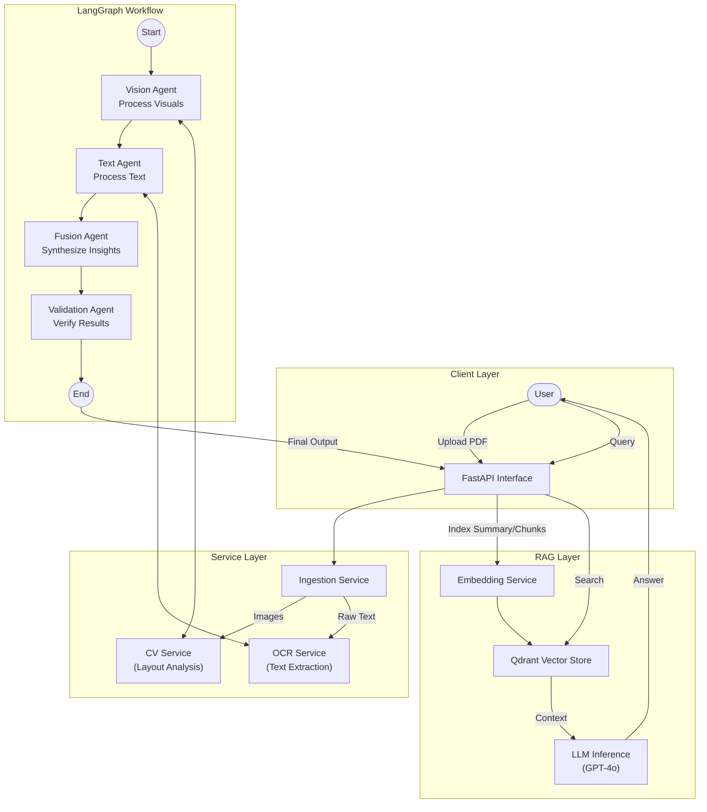

# 📄 Multi-Modal Document Intelligence System

   

A powerful, agentic AI system designed to unlock intelligence from complex, multi-modal documents (PDFs containing text, images, and tables). By leveraging a graph-based agent architecture, this system ingests, analyzes, fuses, and validates information to provide high-quality insights and RAG (Retrieval-Augmented Generation) capabilities.

---

## 🚀 Overview

Traditional RAG systems often struggle with complex PDF layouts and visual information. This project solves that by treating **Vision** and **Text** as first-class citizens.
The system uses a **LangGraph** workflow to orchestrate specialized agents:
1.  **Vision Agent**: Analyzes layout, charts, and images.
2.  **Text Agent**: Extracts and processes textual content.
3.  **Fusion Agent**: Synthesizes insights from both modalities.
4.  **Validation Agent**: Ensures data quality and consistency.

The result is a searchable, queryable knowledge base that "sees" documents the way humans do.

---

## 🏗️ System Architecture

The following diagram illustrates the agentic workflow and data pipeline:



---

## ✨ Key Features

-   **Multi-Modal Ingestion**: Converting PDFs to images for deep visual analysis while retaining text capabilities.
-   **Intelligent Routing**: Determines if pages are scanned (requires OCR) or digital-native.
-   **Agentic Workflow**: Modular agents (Vision, Text, Fusion, Validation) coordinated via `LangGraph`.
-   **Visual QA**: Can answer questions based on charts, graphs, and layouts.
-   **Self-Correction**: Validation agent assigns confidence scores and notes potential issues.
-   **Vector Search**: Built-in `Qdrant` vector store for semantic search and retrieval.
-   **Modern API**: Fully typed `FastAPI` backend with Swagger UI documentation.

---

## 🛠️ Technology Stack

-   **Backend Framework**: FastAPI
-   **Agent Orchestration**: LangGraph, LangChain
-   **LLMs**: OpenAI GPT-4o / GPT-4o-mini (Configurable)
-   **Vector Database**: Qdrant (Local memory/Disk)
-   **Computer Vision**: Ultralytics YOLOv8, LayoutParser, EasyOCR, Tesseract
-   **PDF Processing**: pdf2image, Poppler, PyMuPDF
-   **Containerization**: Docker

---

## 📦 Getting Started

### Prerequisites

-   **Docker** (Recommended) OR **Python 3.10+**
-   **OpenAI API Key** (Required for Agents & Embeddings)

### 🟢 Option A: Run with Docker (Recommended)

1.  **Clone the repository**
    ```bash
    git clone <repository-url>
    cd <repository-name>
    ```

2.  **Set up environment variables**
    Create a `.env` file in the root directory:
    ```env
    OPENAI_API_KEY=your_sk_key_here
    ```

3.  **Build and Run**
    ```bash
    docker build -t doc-intel-system .
    docker run -p 8000:8000 --env-file .env doc-intel-system
    ```

### 🟡 Option B: Local Development

1.  **Install System Dependencies**
    You need `tesseract-ocr` and `poppler-utils` installed on your machine.
    *   **Ubuntu**: `sudo apt-get install tesseract-ocr poppler-utils`
    *   **Mac**: `brew install tesseract poppler`
    *   **Windows**: Download installers for [Tesseract](https://github.com/UB-Mannheim/tesseract/wiki) and [Poppler](https://github.com/oschwartz10612/poppler-windows).

2.  **Create Virtual Environment**
    ```bash
    python -m venv venv
    source venv/bin/activate  # On Windows: venv\Scripts\activate
    ```

3.  **Install Python Dependencies**
    ```bash
    pip install -r requirements.txt
    ```

4.  **Run the Server**
    ```bash
    uvicorn app.main:app --reload
    ```

---

## 📖 Usage

Once the server is running, access the interactive API docs at:
👉 **[http://localhost:8000/docs](http://localhost:8000/docs)**

### 1. Analyze a Document (Ingest)

Upload a PDF for processing. This triggers the agentic workflow.

-   **Endpoint**: `POST /api/analyze`
-   **Curl Example**:
    ```bash
    curl -X POST "http://localhost:8000/api/analyze" \
         -H "accept: application/json" \
         -H "Content-Type: multipart/form-data" \
         -F "file=@/path/to/your/document.pdf"
    ```
-   **Response**: JSON containing vision insights, text summary, and validation score.

### 2. Query the Knowledge Base (RAG)

Ask questions about the uploaded documents.

-   **Endpoint**: `POST /api/query`
-   **Payload**:
    ```json
    {
      "query": "What are the key financial trends mentioned in the chart on page 1?"
    }
    ```

---

## 📂 Project Structure

```plaintext
.
├── app/
│   ├── agents/          # LangGraph Agents (Vision, Text, Fusion, Validation)
│   ├── api/             # FastAPI Routes
│   ├── core/            # Config & Settings
│   ├── rag/             # Embedding & Vector Store Logic
│   ├── services/        # OCR, CV, and Ingestion Services
│   └── main.py          # App Entry Point
├── Dockerfile           # Docker Configuration
├── requirements.txt     # Python Dependencies
└── README.md            # You are here
```

---

## ⚠️ Notes for Developers

-   **Memory Usage**: The system loads vision models (YOLO, EasyOCR) into memory. Ensure you have at least 4GB of RAM available.
-   **Concurrency**: The current `Qdrant` instance runs in-memory for simplicity. For production, configure a persistent Qdrant instance in `app/core/config.py`.

---

Developed with ❤️ by me.
